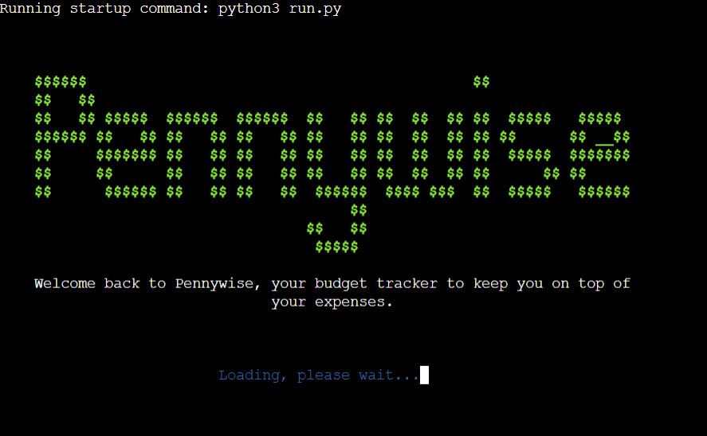
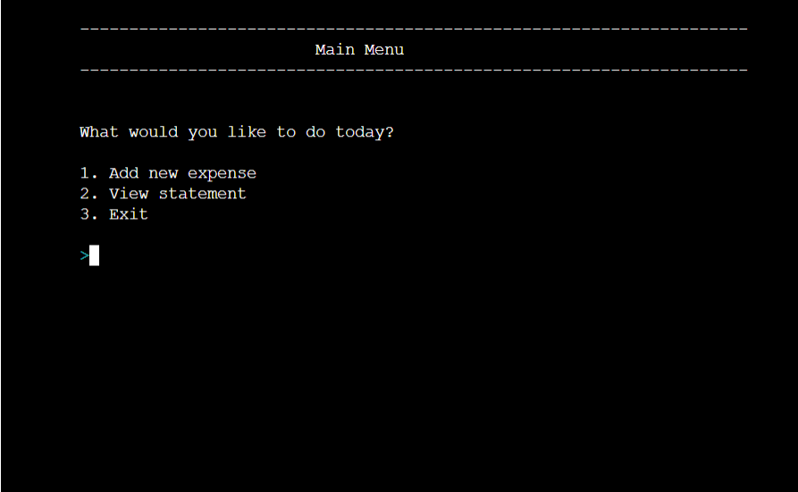
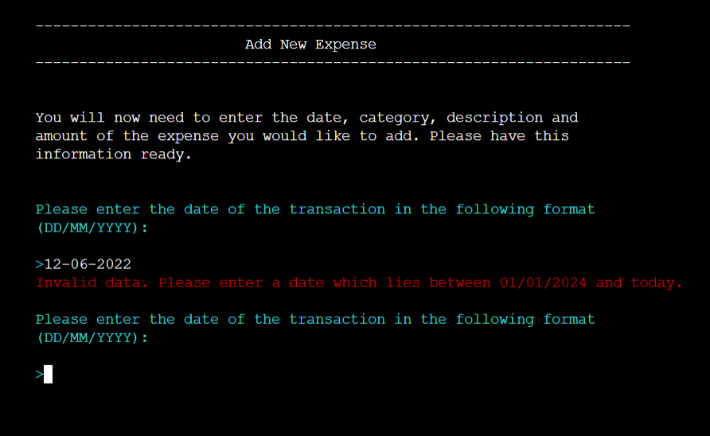
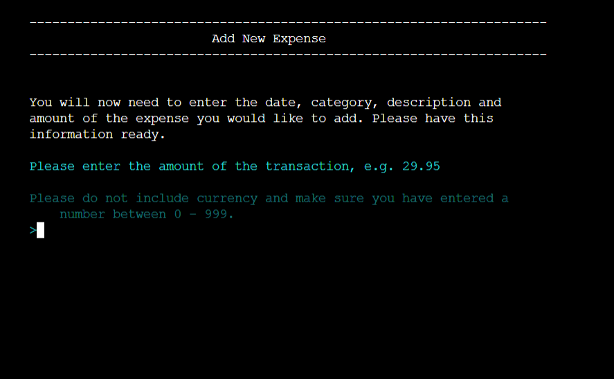

# Pennywise
Pennywise is a budget tracker that has been created with the user in mind.

Welcome to <a href="https://pennywise-budget-tracker-ce1c05dc8133.herokuapp.com/">Pennywise</a>

## Contents
* [**User Experience UX**](<#user-experience-ux>)
  * [Site Owner's Goal](<#site-owner's-goals>)
  * [User Stories](<#user-stories>)
  * [Site Structure](<#site-structure>)
  * [Flowchart](<#flowchart>)
  * [Data Model](<#data-model>)
  * [Design Choices](<#design-choices>)
    * [Typography](<#typography>)
    * [Colour Scheme](<#colour-scheme>)
* [**Features**](<#features>)
  * [Existing Features](<#existing-features>)
    * [Welcome Page](<#welcome-page>)
    * [Main Menu](<#main-menu>)
    * [Add New Expense](<#add-new-expense>)
      * [Add Date of Transaction](<#add-date-of-transaction>)
      * [Add Category of Transaction](<#add-category-of-transaction>)
      * [Add Description of Transaction](<#add-description-of-transaction>)
      * [Add Amount of Transaction](<#add-amount-of-transaction>)
      * [Confirm Expense](<#confirm-expense>)
      * [Update Worksheet](<#update-worksheet>)
    * [View Statement Menu](<#view-statement-menu>)
      * [By Date](<#by-date>)
      * [By Month](<#by-month>)
      * [By Category](<#by-category>)
  * [**Future Features**](<#future-features>)
* [**Technologies Used**](<#technologies-used>)
  * [Languages](<#languages>)
  * [Resources and Tools](<#rescources-and-tools>)
* [**Testing**](<#testing>)
  * [Testing User Stories](<#testing-user-stories>)
  * [Code Validation](<#code-validation>)
  * [Additional Testing](<#additional-testing>)
  * [Known Bugs](<#known-bugs>)
* [**Deployment**](<#deployment>)
  * [**To Deploy the Project**](<#to-deploy-the-project>)
  * [**To Fork the Project**](<#to-fork-the-project>)
  * [**To Clone the Project**](<#to-clone-the-project>)
* [**Credits**](<#credits>)
  * [**Content**](<#content>)
  * [**Media**](<#media>)
* [**Acknowledgements**](<#acknowledgements>)

# User Experience UX
### Site Owner's Goal
* Site Owner:
    - As a site owner, I want users to easily understand what the program does.
    - As a site owner, I want users to be able to navigate through the program without any issues.
    - As a site owner, I want users to be able to add their expenses, view their expenses.

### User Stories

 * Site-users:
    - As a user, I want to understand what the program does instantly. 
    - As a user, I want to be able to add my expenses and confirm if they are correct.
    - As a user, I want to be able to track my expenses.
    - As a user, I want to be able to view my expenses in different formats that are easy to understand.
    - As a user, I want to get visual feedback when I've done something wrong.

[Back To Top](<#contents>)

### Site Structure

Pennywise is a terminal based application that consists of one page.When the program is run, the user is shown the welcome page with the program's name and a short message explaining what it is. After a short while the user is shown the Main Menu. The Main Menu has four option: add new expense, view statement, view budget goals and exit.

Pennywise was structured with the user in mind, whichever option the user chooses, once they have completed that action they are given the option to go back to the Main Menu or in some cases a sub-menu.

At the top left of the page, just above the console screen, there is a Run Program button which will reload Pennywise.

[Back To Top](<#contents>)

### Flowchart

The flowchart for Pennywise was made with the online service [Diagrams.net](https://app.diagrams.net/). The goal was to keep it as simple to understand as possible. It was made prior to starting and was a very helpful guide when coding the logic.

Flowchart

[Back To Top](<#contents>)

### Data Model

[Google Sheets](https://workspace.google.com/products/sheets/) have been used to store all data. All data the the user inputs and views is retreived from and update to the Google Sheet. The name of the workbook is Pennywise and the name of the worksheet is user1.

The worksheet has 4 columns of data that save the date, category, description and amount of each transaction.

Google Sheet

[Back To Top](<#contents>)

### Design Choices

 - ### Typography
   Due to Pennywise being a terminal based application, no specific typography has been used. The standard font is being used in the terminal.

 - ### Colour Scheme
   Pennywise is back-end program therefore not much styling or visual design has been implementes. 

   * [Colorama](https://pypi.org/project/colorama/) library for Python was used to add colour to the program to give visual feedback to the user.
      - Red has been used for invalid input messages.
      - Blue has been used for loading messages.
      - Yellow has been used for messages regarding exiting the program   
        or returning to the Main Menu.
      - Cyan has been used for the please note messages in the view 
        statement section.
      - Light cyan has been used for instructions before user input.
      - Magenta has been for feedback regarding the worksheet being 
        updated successfully.
      - Dim style has been used to give extra information about user input.

 [Back To Top](<#contents>)

# Features
  ## Existing Features

  - ### Welcome Page
    When the user first enters the site, the welcome page greets them. The user sees the logo and a short message explaining what the program does. Whilst the user is viewing this page, the [Main Menu](<#main-menu>) is loading.
  
    

Welcome Page

    
    
    
    

    [Back To Top](<#contents>)

  - ### Main Menu
    The [Main Menu](<#main-menu>) gives the user 3 choices: [Add New Expense](<#add-new-expense>), [View Statement](<#view-statement>) or Exit. If the user chooses to exit, they will be redirected back to the [Welcome Page](<#welcome-page>).

    

Main Menu

      
    

    

    [Back To Top](<#contents>)

  - ### Add New Expense
    The add new expense function collects 4 pieces of information from the user. These are the [date](<#add-date-of-transaction>), [category](<#add-category-of-transaction>), [description](<#add-description-of-transaction>) and [amount](<#add-amount-of-transaction>) of the transaction. Once all 4 details have been collected, the user is shown a summary of that information in the [Confirm Transaction](<#confirm-transaction>) function. If the user confirms all the details are correct. The google worksheet will be updated with the new expense. However, if the user entered something wrong they can choose to add the information again, or even return to the [Main Menu](<#main-menu>).

    [Back To Top](<#contents>)

    - #### Add Date of Transaction
      The user is asked for the date and is shown the format it needs to be in. If the user enters an invalid response an error message appears and the user is asked to re-enter the information in the correct format.

      

Add Date of Transaction

        
      
      
      

      

Invalid Input

        
      
      
      

      [Back To Top](<#contents>)
    
    - #### Add Category of Transaction
      The user is asked for the category of the transaction. If the user enters an invalid response an error message appears and the user is asked to re-enter the information in the correct format.

      

Add Category of Transaction

      
      
      
      

      

Invalid Input

        
      
      
      

      [Back To Top](<#contents>)

    - #### Add Description of Transaction
      The user is asked for the description of the transaction. If the user enters an invalid response an error message appears and the user is asked to re-enter the information in the correct format.
    
      

Add Description of Transaction

        
      
      
      

      

Invalid Input

        
      
      
      

      [Back To Top](<#contents>)

    - #### Add Amount of Transaction
      The user is asked for the amount of the transaction. They are shown the format the input needs to be. If the user enters an invalid response an error message appears and the user is asked to re-enter the information in the correct format.
    

Add Amount of Transaction

      
      
      
      

      

Invalid Input

        
      
      
      

      [Back To Top](<#contents>)

    - #### Confirm Expense
      Th user is shown all the information they have entered in the previous 4 steps in a format that is easy to read and understand. The user is asked to confirm if this information is correct. 
      
      If the user chooses 'Y', the worksheet will be updated and the user will receive feedback once it has been successful. 
      
      However, if the user chooses 'N' they will be shown a new menu of choices. They can choose to re-enter the informtion and be taken back to the [add new expense](<#add-new-expense>) process, return to [main menu](<#main-menu>) or choose to confirm the information above. The third option is in case the user mis-typed their answer before.

      If the user inputs in invalid response they will be shown an error message and be asked to enter a valid response.

      

Confirm Transaction Page

        
      
      
      

      

Confirm Transaction Invalid Input

        
      
      
      

      

Confirm Transaction Page if answered 'N'

        
      
      
      

      [Back To Top](<#contents>)

    - #### Update Worksheet
      Onces the user has been shown the worksheet has been updated successfully, they are shown another menu. They have 2 choices, to add another expense of to return to the main menu. The user will be shown an error message and asked to a valid response if they enter an invalid answer. 

      

Worksheet Updated

        
      
      
      

      

Worksheet Menu Invalid Input

        
      
      
      

      [Back To Top](<#contents>)

  
  - ### View Statement Menu
    The view statement page displays to the user 3 ways in which they can see their statement: [by date](<#by-date>), [by month](<#by-month>) or [by category](<#by-category>). They are also given the option to return to the [main menu](<#main-menu>) if they enter 'MM'. If the user enters and invalid reponse they will be shown an error message.

    

View Statement Menu

      
    
    
    

    

View Statement Menu Invalid Input

      
    
    
    

    [Back To Top](<#contents>)
    
    - #### By Date
      The user is shown all transactions to date in a format that is easy to read and understand. Under all the transactions the user is asked if they would like to return to the [main menu](<#main-menu>) or the [view statement menu](<#view-statement-menu>). If the user enters and invalid response they are shown an error message and asked to enter their response again.

      

View Statement By Date

        
      
      
      

      

View Statement By Date Menu Invalid Input

        
      
      
      

      [Back To Top](<#contents>)

    - #### By Month
      The user is shown the total amount they have spent each month. Below there is a choice menu

      

View Statement By Month

        
      
      
      

      

View Statement By Month Menu Invalid Input

        
      
      
      

      [Back To Top](<#contents>)

    - #### By Category
      The user is shown how much they have spent in each category from the beginnning of the year to date.

      

View Statement By Category

        
      
      
      

      

View Statement By Category Menu Invalid Input

        
      
      
      

    
      [Back To Top](<#contents>)

### Future Features

  - Give the user the ability to delete transactions or edit parts of an expense.
  - Give the user the ability to input any income.
  - Generate an automated total for the View Statement By Month page. Currently the site owner has to add the code for every new month after an expense has been added for that month.
  - The ability to login with a username and password to keep data safe and secure.
  - The ability to add more users with the use of multiple google sheets.
  -  Have a budget goals section when the user can set their target spending for each category.
      - To encourage users to meet their target they would be shown a congratulatory message if they succeed. 
      - On the other hand, if the overspend they would be shown an image of a scary, angry clown. The idea for this comes from the name  'Pennywise', being that it is the name of the clown from the movie 'It'.

 [Back To Top](<#contents>)

# Technologies Used

### Languages

The following languages were used to create and develop this website:

* [Python3](https://www.python.org/)

Provided as part of Code Institute's template:

* [HTML5](https://html.spec.whatwg.org/)
* [JavaScript](https://developer.mozilla.org/en-US/docs/Learn/JavaScript/First_steps/What_is_JavaScript)

### Frameworks, Libraries and Packages
* [Google Sheets](https://workspace.google.com/products/sheets/) - used to host the application data.
* [Gitpod](https://www.gitpod.io/#get-started) - used for writing code, committing and pushing to [Github](https://github.com/).
* [Github](https://github.com/) - used for storing the repository and for version control.
* [Gitbash](https://en.wikipedia.org/wiki/Bash_(Unix_shell)) - used to host and edit the project. before committing.
* [Heroku](https://dashboard.heroku.com/) - used to deploy and host the project. 
* [GSpread](https://docs.gspread.org/en/latest/) - used to manipulate the date in the [google sheet](https://workspace.google.com/products/sheets/).
* [GoogleOAuth](https://developers.google.com/identity/protocols/oauth2) - used to authenticate the program to access Google's API.
* [Patorjk](https://patorjk.com/) - used to create the logo, however it had to be edited as was too large for the console.
* [Time](https://docs.python.org/3/library/time.html) - used to delay clear screen.
* [Os](https://docs.python.org/3/library/os.html) - used to clear screen in between menus and where the user needs to input data.
* [Sys](https://docs.python.org/3/library/sys.html) - used for typing print function.
* [Datetime](https://docs.python.org/3/library/datetime.html) - used to validate date inputs.
* [Tabulate](https://pypi.org/project/tabulate/) - used to organise date into table format.
* [Math](https://docs.python.org/3/library/math.html) - used for sums and to round.
* [Colorama](https://pypi.org/project/colorama/) - used to add colour to the terminal.
* [CloudConvert](https://cloudconvert.com/png-to-webp) - used to convert images to  webp.
* [TinyPNG](https://tinypng.com/) - used to optimize images.
* [PEP8](https://peps.python.org/pep-0008/) - used to validate python code.

 [Back To Top](<#contents>)

# Testing
### Testing User Stories
  * Site Owner:
    - As a site owner, I want users to easily understand what the program does.
        - On the welcome page, it clearly states that Pennywise is a budget tracker. Also on the main menu all options are to do with expenses.

    - As a site owner, I want users to be able to navigate through the program without any issues.
        - Each time the user completes a section, there is a choice menu where users can reach different parts of the program.

    - As a site owner, I want users to be able to add their expenses, view their expenses.
        - Pennywise has two main sections, the first where users can add new transactions and the second where users can view their expenses in 3 different ways. 

 * Site-users:
    - As a user, I want to understand what the program does instantly. 
        - The name of the site is 'Pennywise' where penny is the smallest denomination of the pound sterling and wise means to have experience, knowledge and good judgement. Not only this, but there is a welcome message stating the Pennywise is a buget tracker.

    - As a user, I want to be able to add my expenses and confirm if they are correct.
        - Users can add expenses by inputting 4 key details. At every step of the way there is input validation and before the user adds the new transaction to the worksheet they must confirm that all details are correct.

    - As a user, I want to be able to track my expenses.
        - In the view statement section, users can see their statement by date. 

    - As a user, I want to be able to view my expenses in different formats that are easy to understand.
        - Pennywise displays the users' expenses in 3 different ways, depending on their needs.

    - As a user, I want to get visual feedback when I've done something wrong.
        - If the user's input is not valid, a red error message appears on screen with some extra information to help the user respond correctly.

  [Back To Top](<#contents>)

### Validation
#### Code Validation
  #### Python Validation

  The code was validated using Pep8 Linter. No errors were found in its final testing.

  

PEP8 Code Validator

  
  

  

  #### HTML Validation

  No errors were returned when passing through the official W3C validator.

  

HTML5 Code Validator

  
  

  

  #### CSS Validation

  No errors were returned when passing through the official W3C validator.

  

CSS Code Validator

  
  

  
  

 [Back To Top](<#contents>)

### Additional Testing
  #### Responsiveness Test

  This project does not require a fully responsive design. However, I tested Pennywise with a few more methods. The site is not compatible with mobile phones or tablets.

  #### Browser Compatability

  #### Lighthouse

  The site was tested using [Google Lighthouse](https://developers.google.com/web/tools/lighthouse). The results were as follows:

  

Google Lighthouse Result

  
  

  

  #### WAVE

  The site was also tested using [Wave](https://wave.webaim.org/). There are no errors howvever there is 1 contrast error. This error is on the button 'Run Program' which is part of the code supplied in the Code Institute template. There are also 2 alerts, which are also from the Code Institute template: the first being that there is no heading structure and the second that there are no page regions.

  

WAVE Result

  
  

  

  
  [Back To Top](<#contents>)

### Known Bugs
#### Fixed Bugs
  - During my mid-way point mentor session, a few bugs were found:

      - The first being that a user could input blank spaces for the expense category and the expense description meaning empty cells would be uploaded to the connected worksheet. This was a problem due to having empty strings when the data was 
      iterated over. 
        - The appropriate method was added to validate that the user's input is all letters. This solution does however mean that Pennywise can only accept 1 word answers for both categories.

      - The second being that a user could input a negative number for the expense amount. This was a problem due to a negative sign not being able to be converted into a float.
        - Parameters were added to the code to only accept numbers higher than 0.

      - The third being that four or more invalid inputs by the user crashed the program resulting in the user having to refresh the page or having to press the 'Run Program' button to exit out of the crashed site and start again. 
        - All code was arranged into while loops to stop this from happening.

      - The fourth and biggest bug was the clear screen function not working. When the user was asked to input the date, the category, the description and the amount, segments of the previous 'page' were left on the screen. This was a very tough bug to overcome - taking over 24 hours.
        - Lots of research was done and the function was moved to different parts of the code to see if it would work elsewhere. The solution to this problem was finally found on slack where a fellow coursemate had the same problem. The fix was easy, all that needed to be done was to add 'print(“\033c”, end=“”)' to the clear screen function. I am very grateful to my coursemates on slack as without them I do not know If I would have been able to 'squash' this bug.
    
  - During the final stages of the project, a few more bugs appeared:

    - The first being an infinite loop of invalid error messages.
      - This had a quick fix, the code had to be nested perfectly into the try/except block and if/else clause if there was one.

    - Previously to using [colorama](https://pypi.org/project/colorama/) to print colours to the terminal, [ANSI colors](https://pypi.org/project/ansicolors/) was used. The switch ocurred due to random numbers from the colour codes being printed to the terminal and the text itself not being in the correct colour.
      - After much research, it was decided that [colorama](https://pypi.org/project/colorama/) would be a better fit for the project.

# Deployment
The program was developed using [Gitpod](https://www.gitpod.io/#get-started). All commit messages were pushed to  which was then committed and pushed to [Github](https://github.com/) using the GitPod terminal. The finished project was deployed in [Heroku](https://dashboard.heroku.com/).

  Before starting the process on [Heroku](https://dashboard.heroku.com/), you first need to enter 'pip3 freeze > requirements.txt' in the terminal in your IDE. This adds a list of dependencies to your requirements.txt file needed for deployment. Commit these changes and push to GitHub before you deploy.

      - You can also update your requirements.txt file once you have already deployed to Heroku, by entering 'pip freeze > requirements.txt'. Don't forget to commit your changes and push to GitHub.

  The process of deploying to [Heroku](https://dashboard.heroku.com/) is as follows:

  1. Log into [Heroku](https://dashboard.heroku.com/) (or create an account).

  

Heroku Step 1

  
  

  

  2. In the top right hand corner there is a button 'New' that releases a dropdown menu, where you need to click 'Create a new app'.

  

Heroku Step 2

  
  

  

  3. On the next page, you will need to add a name for your app and input what region you are in. Bear in mind that each app name is unique therefore you may need to try some different options out. Once you have decided on an app name and selected which region you are in. Click 'Create app'

  

Heroku Step 3

  
  

  

  4. On the next page, click the 'Settings' tab. Once you have clicked on the settings tab, click 'Reveal Config Vars' in the 'Config Vars' section. Next you will need to add values. For Pennywise, two values were added:
      - The first was the credentials (KEY = "CREDS", VALUE = "my credentials"). Once the key and value input fields have been filled you have to click 'Add'.
      - The second was KEY = "PORT", VALUE = "8000". Then click 'Add'

  

Heroku Step 4 - Settings Tab

  
  

  

  

Heroku Step 4 - Config Vars Section

  
  

  

  

Heroku Step 4 - Config Vars Section - KEY / VALUE Inputs

  
  

  

  5. Next you need to add buildpacks to the application which will run when the application is deployed. These allow all dependencies to be installed for the application. The 'Buildpacks' are located under the 'Config Vars' section on the 'Settings' Tab. Click 'Add buildpack'. Click on 'python', then 'Add Buildpack'. Then click 'node.js', then 'Add Buildpack'. The order they are listed is important; python needs to be listed above node.js. If you have added them in the wrong order you can click and drag them to be in the right order.

  

Heroku Step 5 - Buildpacks Section

  
  

  

  

Heroku Step 5 - Add Buildpacks

  
  

  

  6. Next you need to go to the 'Deploy' tab. For 'Deployment Method', click 'GitHub'. Search for the repository name you want to deploy and then click connect.

  

Heroku Step 6 - Deploy Tab

  
  

  

  

Heroku Step 6 - Deployment Method

  
  

  

  

Heroku Step 6 - Connect to GitHub

  
  Pennywise has already been connected to Heroku so mine will look a little different from yours. However, where you can see 'App Connected to GitHub' on the image, you will see 'Connect to GitHub, next to that you'll be able to search for the repository you want to connect.

  

  

  7. Scroll down to the sections below, called 'Automatic Deploys' and 'Manual Deploy'. Here you need to choose which option best suits your project. Once selected, click 'Deploy Branch'.

  

Heroku Step 7 - Deploy

  I have chosen to go ahead with 'Automatic Deploys' so I don't have to manually deploy every time I push to GitHub.
  
  

  

The live link can be found here - https://bpstephanie.github.io/The_Country_Quiz/ 

### **To Fork the Project**

A copy of the GitHub Repository can be made by forking the GitHub account. This copy can be viewed and changes can be made to the copy without affecting the original repository. The steps to fork the repository are as follows:

  1. Log in to GitHub and locate the repository.

  

  2. On the right hand side of the page, in line with the repository name, is a button called 'Fork', click on the button to create a copy of the original repository in your GitHub Account.
  
  

### **To Clone the Project**

The steps to clone a project from GitHub are as follows:

  1. Under the repository’s name, click on the code tab.
  2. Copy the URL under the Clone with HTTPS section.
  3. In an IDE of your choice, open Git Bash.
  4. Change the current working directory to the location of where the cloned directory will be made.
  5. Type 'git clone' then paste the URL copied from GitHub.
  6. Upon pressing enter, the local clone will be created.

[Back To Top](<#contents>)

## Credits 

* In the get transaction date function: 
    - The code to convert user date input into datetime object was inspired by the following question and answer in [Stack Overflow](https://stackoverflow.com/questions/53248537/typeerror-not-supported-between-instances-of-datetime-datetime-and-str).

* In the get transaction category function: 
    - The code to remove duplicates from a list was inspired by [Data Quest](https://www.dataquest.io/blog/how-to-remove-duplicates-from-a-python-list/).

* In the get transaction description function: 
    - The code to only accept letters was inspired by [Shiksha](https://www.shiksha.com/online-courses/articles/isalpha-method-in-python/#:~:text=The%20isalpha()%20method%20can,entered%20only%20contains%20alphabetic%20characters.)

    - The code to disallow the user from only entering, starting with or ending with whitespace was inspired by the following question and answer in [Stack Overflow](https://stackoverflow.com/questions/68417120/not-allowing-spaces-in-string-input-python)

* In get transaction amount function:
    - The code for rounding user input to 2 decimal places was inspired by the following question and answer in [Stack Overflow](https://stackoverflow.com/questions/51690770/how-to-restrict-user-to-input-only-upto-two-decimal-point-float-numbers-in-pytho)

* In by date function (part of view statement section):
    - The code for sorting the date by date was inspired by [Python Docs](https://docs.python.org/3/howto/sorting.html)

[Back To Top](<#contents>)

### Content

* All of the content was written by myself.

[Back To Top](<#contents>)

## Acknowledgements

Pennywise has been completed as a Portfolio 3 Project, part of the Full Stack Software Developer Diploma at Code Institute. I would like to thank my Code Institute mentor,  Precious Ijege for his advice and support, the Slack community, and everyone at Code Institute for their feedback and guidance. 

Stephanie Bell 2024.

 [Back To Top](<#contents>)