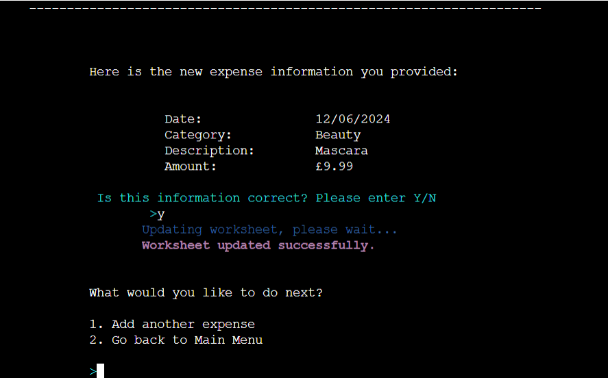

# Pennywise
Pennywise is a budget tracker that has been created with the user in mind.

Welcome to <a href="https://pennywise-budget-tracker-ce1c05dc8133.herokuapp.com/">Pennywise</a>

## Contents
* [**User Experience UX**](<#user-experience-ux>)
  * [Site Owner's Goal](<#site-owner's-goals>)
  * [User Stories](<#user-stories>)
  * [Site Structure](<#site-structure>)
  * [Flowchart](<#flowchart>)
  * [Data Model](<#data-model>)
  * [Design Choices](<#design-choices>)
    * [Typography](<#typography>)
    * [Colour Scheme](<#colour-scheme>)
* [**Features**](<#features>)
  * [Existing Features](<#existing-features>)
    * [Welcome Page](<#welcome-page>)
    * [Main Menu](<#main-menu>)
    * [Add New Expense](<#add-new-expense>)
      * [Add Date of Transaction](<#add-date-of-transaction>)
      * [Add Category of Transaction](<#add-category-of-transaction>)
      * [Add Description of Transaction](<#add-description-of-transaction>)
      * [Add Amount of Transaction](<#add-amount-of-transaction>)
      * [Confirm Expense](<#confirm-expense>)
      * [Update Worksheet](<#update-worksheet>)
    * [View Statement Menu](<#view-statement-menu>)
      * [By Date](<#by-date>)
      * [By Month](<#by-month>)
      * [By Category](<#by-category>)
  * [**Future Features**](<#future-features>)
* [**Technologies Used**](<#technologies-used>)
  * [Languages](<#languages>)
  * [Resources and Tools](<#rescources-and-tools>)
* [**Testing**](<#testing>)
  * [Code Validation](<#code-validation>)
  * [Additional Teasting](<#additional-testing>)
  * [Known Bugs](<#known-bugs>)
* [**Deployment**](<#deployment>)
  * [**To Deploy the Project**](<#to-deploy-the-project>)
  * [**To Fork the Project**](<#to-fork-the-project>)
  * [**To Clone the Project**](<#to-clone-the-project>)
* [**Credits**](<#credits>)
  * [**Content**](<#content>)
  * [**Media**](<#media>)
* [**Acknowledgements**](<#acknowledgements>)

# User Experience UX
### Site Owner's Goal
* Site Owner:
    - As a site owner, I want users to easily understand what the program does.
    - As a site owner, I want users to be able to navigate through the program without any issues.
    - As a site owner, I want users to be able to add their expenses, view their expenses and set their budget goals.

### User Stories

 * Site-users:
    - As a user, I want to understand what the program does instantly. 
    - As a user, I want to be able to add my expenses and confirm if they are correct.
    - As a user, I want to be able to track my expenses.
    - As a user, I want to be able to view my expenses in different formats that are easy to understand.
    - As a user, I want to get visual feedback when I've done something wrong.
    - As a user, I want 

[Back To Top](<#contents>)

### Site Structure

Pennywise is a terminal based application that consists of one page.When the program is run, the user is shown the welcome page with the program's name and a short message explaining what it is. After a short while the user is shown the Main Menu. The Main Menu has four option: add new expense, view statement, view budget goals and exit.

Pennywise was structured with the user in mind, whichever option the user chooses, once they have completed that action they are given the option to go back to the Main Menu or in some cases a sub-menu.

At the top left of the page, just above the console screen, there is a Run Program button which will reload Pennywise.

[Back To Top](<#contents>)

### Flowchart

The flowchart for Pennywise was made with the online service [Diagrams.net](https://app.diagrams.net/). The goal was to keep it as simple to understand as possible. It was made prior to starting and was a very helpful guide when coding the logic.

Flowchart

[Back To Top](<#contents>)

### Data Model

[Google Sheets](https://workspace.google.com/products/sheets/) have been used to store all data. All data the the user inputs and views is retreived from and update to the Google Sheet. The name of the workbook is Pennywise and the name of the worksheet is user1.

The worksheet has 4 columns of data that save the date, category, description and amount of each transaction.

Google Sheet

[Back To Top](<#contents>)

### Design Choices

 - ### Typography
   Due to Pennywise being a terminal based application, no specific typography has been used. The standard font is being used in the terminal.

 - ### Colour Scheme
   Pennywise is back-end program therefore not much styling or visual design has been implementes. 

   * [Colorama](https://pypi.org/project/colorama/) library for Python was used to add colour to the program to give visual feedback to the user.
      - Red has been used for invalid input messages.
      - Blue has been used for loading messages.
      - Yellow has been used for messages regarding exiting the program   
        or returning to the Main Menu.
      - Cyan has been used for the please note messages in the view 
        statement section.
      - Light cyan has been used for instructions before user input.
      - Magenta has been for feedback regarding the worksheet being 
        updated successfully.
      - Dim style has been used to give extra information about user input.

 [Back To Top](<#contents>)

# Features
  ## Existing Features

  - ### Welcome Page
    When the user first enters the site, the welcome page greets them. The user sees the logo and a short message explaining what the program does. Whilst the user is viewing this page, the [Main Menu](<#main-menu>) is loading.
  
  

Welcome Page

  
  
  
  

  - ### Main Menu
    The [Main Menu](<#main-menu>) gives the user 3 choices: [Add New Expense](<#add-new-expense>), [View Statement](<#view-statement>) or Exit. If the user chooses to exit, they will be redirected back to the [Welcome Page](<#welcome-page>).

  

Main Menu

    
  

  

  - ### Add New Expense
    The add new expense function collects 4 pieces of information from the user. These are the [date](<#add-date-of-transaction>), [category](<#add-category-of-transaction>), [description](<#add-description-of-transaction>) and [amount](<#add-amount-of-transaction>) of the transaction. Once all 4 details have been collected, the user is shown a summary of that information in the [Confirm Transaction](<#confirm-transaction>) function. If the user confirms all the details are correct. The google worksheet will be updated with the new expense. However, if the user entered something wrong they can choose to add the information again, or even return to the [Main Menu](<#main-menu>).

    - #### Add Date of Transaction
      The user is asked for the date and is shown the format it needs to be in. If the user enters an invalid response an error message appears and the user is asked to re-enter the information in the correct format.
    

Add Date of Transaction

      
    
    
    

    

Invalid Input

      
    
    
    

    
    - #### Add Category of Transaction
      The user is asked for the category of the transaction. If the user enters an invalid response an error message appears and the user is asked to re-enter the information in the correct format.
    

Add Category of Transaction

    
    
    
    

    

Invalid Input

      
    
    
    

    - #### Add Description of Transaction
      The user is asked for the description of the transaction. If the user enters an invalid response an error message appears and the user is asked to re-enter the information in the correct format.
    
    

Add Description of Transaction

      
    
    
    

    

Invalid Input

      
    
    
    

    - #### Add Amount of Transaction
      The user is asked for the amount of the transaction. They are shown the format the input needs to be. If the user enters an invalid response an error message appears and the user is asked to re-enter the information in the correct format.
    

Add Amount of Transaction

      
    
    
    

    

Invalid Input

      
    
    
    

    - #### Confirm Expense
      Th user is shown all the information they have entered in the previous 4 steps in a format that is easy to read and understand. The user is asked to confirm if this information is correct. 
      
      If the user chooses 'Y', the worksheet will be updated and the user will receive feedback once it has been successful. 
      
      However, if the user chooses 'N' they will be shown a new menu of choices. They can choose to re-enter the informtion and be taken back to the [add new expense](<#add-new-expense>) process, return to [main menu](<#main-menu>) or choose to confirm the information above. The third option is in case the user mis-typed their answer before.

      If the user inputs in invalid response they will be shown an error message and be asked to enter a valid response.
    

Confirm Transaction Page

      
    
    
    

    

Confirm Transaction Invalid Input

      
    
    
    

    

Confirm Transaction Page if answered 'N'

      
    
    
    

    - #### Update Worksheet
      Onces the user has been shown the worksheet has been updated successfully, they are shown another menu. They have 2 choices, to add another expense of to return to the main menu. The user will be shown an error message and asked to a valid response if they enter an invalid answer. 

    

Worksheet Updated

      
    
    
    

    

Worksheet Menu Invalid Input

      
    
    
    

  
  - ### View Statement Menu
    The view statement page displays to the user 3 ways in which they can see their statement: [by date](<#by-date>), [by month](<#by-month>) or [by category](<#by-category>). They are also given the option to return to the [main menu](<#main-menu>) if they enter 'MM'. If the user enters and invalid reponse they will be shown an error message.

    

View Statement Menu

      
    
    
    

    

View Statement Menu Invalid Input

      
    
    
    

    
    - #### By Date
      The user is shown all transactions to date in a format that is easy to read and understand. Under all the transactions the user is asked if they would like to return to the [main menu](<#main-menu>) or the [view statement menu](<#view-statement-menu>). If the user enters and invalid response they are shown an error message and asked to enter their response again.

    

View Statement By Date

      
    
    
    

    

View Statement By Date Menu Invalid Input

      
    
    
    

    - #### By Month
      The user is shown the total amount they have spent each month. Below there is a choice menu

    

View Statement By Month

      
    
    
    

    

View Statement By Month Menu Invalid Input

      
    
    
    

    - #### By Category      
  
 [Back To Top](<#contents>)

### Future Features

  -  Have a budget goals section when the user can set their target spending for each category. To encourage users to meet their target they would be shown a congratulatory message if they succeed. On the other hand, if the overspend they would be shown an image of a scary, angry clown. The idea for this comes from the name  'Pennywise', being that it is the name of the clown from the movie 'It'.
  - Give the user the ability to delete transactions or edit parts of an expense.
  - Give the user the ability to input any income and deduct spending from that.
  - An automated total for the View Statement By Month page, currently the site owner has to add the code for every new month after an expense has been added for that month.
  - The ability to login with a username and password to keep data safe and secure.
  - The ability to add more users with the use of multiple google sheets.

 [Back To Top](<#contents>)

# Technologies Used

### Languages

The following languages were used to create and develop this website:

* [Python](https://www.python.org/)

### RFrameworks, Libraries and Packages
* [Google Sheets](https://workspace.google.com/products/sheets/)
* [Gitpod](https://www.gitpod.io/#get-started) 
* [Github](https://github.com/)
* [Gitbash](https://en.wikipedia.org/wiki/Bash_(Unix_shell))
* [Heroku](https://dashboard.heroku.com/)
* [GSpread](https://docs.gspread.org/en/latest/)
* [GoogleOAuth](https://developers.google.com/identity/protocols/oauth2)
* [Patorjk](https://patorjk.com/) - used to create the logo, however it had to be edited as was too large for the console.
* [Time](https://docs.python.org/3/library/time.html)
* [Os](https://docs.python.org/3/library/os.html)
* [Sys](https://docs.python.org/3/library/sys.html)
* [Datetime](https://docs.python.org/3/library/datetime.html)
* [Tabulate](https://pypi.org/project/tabulate/)
* [Math](https://docs.python.org/3/library/math.html)
* [Collections](https://docs.python.org/3/library/collections.html#)
* [CloudConvert](https://cloudconvert.com/png-to-webp)
* [TinyPNG](https://tinypng.com/)
* [PEP8]

 [Back To Top](<#contents>)

# Testing

 [Back To Top](<#contents>)

# Deployment
This site was deployed to GitHub pages. The steps to deploy are as follows:

  1. In the GitHub repository, navigate to the Settings tab. 
  2. Next, navigate to the Pages tab on the left hand side.
  3. Under Source, select main from the Branch dropdown menu. Then click save.
  4. Once the main branch has been selected, the page will automatically be refreshed with a detailed ribbon display to indicate the successful deployment. 

The live link can be found here - https://bpstephanie.github.io/The_Country_Quiz/ 

### **To Fork the Project**

A copy of the GitHub Repository can be made by forking the GitHub account. This copy can be viewed and changes can be made to the copy without affecting the original repository. The steps to fork the repository are as follows:

  1. Log in to GitHub and locate the repository.
  2. On the right hand side of the page, in line with the repository name, is a button called 'Fork', click on the button to create a copy of the original repository in your GitHub Account.
  

### **To Clone the Project**

The steps to clone a project from GitHub are as follows:

  1. Under the repository’s name, click on the code tab.
  2. Copy the URL under the Clone with HTTPS section.
  3. In an IDE of your choice, open Git Bash.
  4. Change the current working directory to the location of where the cloned directory will be made.
  5. Type 'git clone' then paste the URL copied from GitHub.
  6. Upon pressing enter, the local clone will be created.

[Back To Top](<#contents>)

## Credits 

* Wireframes: [Balsamiq](https://balsamiq.com)
* Favicon: [Favicon](https://favicon.io/)
* Fonts: [Google Fonts](https://fonts.google.com/)
* Icons: [Fontawesome](https://fontawesome.com/)
* Colour Palettes: [Coolors](https://www.bbcgoodfood.com/)
* Mock-up: [Am I Responsive](https://ui.dev/amiresponsive)
* Chrome for Developers: [Dev Tools](https://developer.chrome.com/docs/devtools)

* The code to create the modals was inspired by [W3Schools](https://www.w3schools.com/howto/howto_css_modals.asp).
* The code to implement audio in JavaScript  by [Noah Ekin](https://noaheakin.medium.com/adding-sound-to-your-js-web-app-f6a0ca728984).
* This YouTube tutorial was followed for the basic setup of the quiz [James Q Quick](https://www.youtube.com/watch?v=zZdQGs62cR8&list=PLDlWc9AfQBfZIkdVaOQXi1tizJeNJipEx&index=4).
* The code to randomize quiz questions was inspired by [She Codes](https://www.shecodes.io/athena/10246-how-to-show-random-questions-in-a-quiz-using-javascript).
* The code for the score area was inspired by the Code Institute Love Maths Project.

[Back To Top](<#contents>)

### Content

* The majority of the quiz question and answer content came from myself. A few questions were fact checked with [Visit South America](https://visitsouthamerica.co/)

[Back To Top](<#contents>)

### Media

The images are from [Pixabay](https://pixabay.com/) and [Flag Colour Codes](https://www.flagcolorcodes.com/).

The llama graphic is from [Pixabay](https://pixabay.com/) and I created the background in [Canva](https://www.canva.com/).

The flag images were made opaque with [OnlinePNGTools](https://onlinepngtools.com/change-png-opacity#:~:text=World's%20simplest%20online%20Portable%20Network,%2C%20quick%2C%20and%20very%20powerful.).

The images were optimised with [Tinypng](https://tinypng.com/).

[Back To Top](<#contents>)

## Acknowledgements

The Country Quiz has been completed as a Portfolio 2 Project, part of the Full Stack Software Developer Diploma at Code Institute. I would like to thank my Code Institute mentor,  Precious Ijege for his advice and support, the Slack community, and everyone at Code Institute for their feedback and guidance. 

Stephanie Bell 2024.

 [Back To Top](<#contents>)